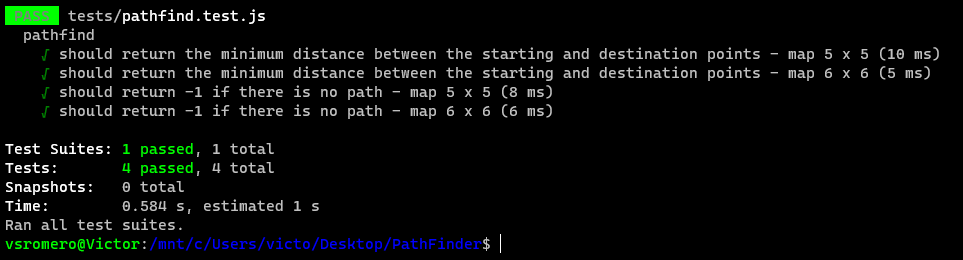

# Pathfind Solution Details 
[Tests Results](#tests) | [Tests Source Code](../tests/pathfind.test.js) | [Back To Main](../README.md) | [Challenge Source Code](./pathfind.js) | [Comments](../README.md/#comments-section)

* ~~~ javascript
    function pathfind(A, P, Q)
    ~~~

It is a function that takes a 2-dimensional array `A` and 2 vectors `P` and `Q`, with `0,0` being the top left corner of the map and returns the distance of the shortest path between those points, respecting the walls in the map.

* ~~~ javascript
    const rows = A.length;
    const cols = A[0].length;
    ~~~	

`rows` and `cols` variables are the number of rows and columns of the map. The `.length` property of an array returns the number of elements in that array.

* ~~~ javascript
    const queue = [];
    ~~~

`queue` is an array that will be used as a queue to store the coordinates of the map that will be visited. I have chose the name `queue` because it is a FIFO (First In First Out) data structure.

* ~~~ javascript
    const visited = new Array(rows);
    for (let i = 0; i < rows; i++) {
        visited[i] = new Array(cols).fill(false);
    }
    ~~~
`visited` is a 2-dimensional array that will be used to store the coordinates of the map that have been visited, using the instance of the `Array` object. However, the initial value of the cells of the array is `undefined`. Therefore, I have used the `fill()` method to fill the array with `false` values, once no cell has been visited yet.

* ~~~ javascript
    const directions = [[-1, 0], [1, 0], [0, -1], [0, 1]];
    ~~~

`directions` is a 2-dimensional array that will be used to store the directions that will be used to move in the map. The first element of each sub-array is the row direction and the second element is the column direction. The order of the sub-arrays is the order of the directions that will be used to move in the map. The first direction on the list will be the first direction to be explored. The second direction on the list will be the second direction to be explored. And so on.

* ~~~ javascript
    const isValid = (row, col) => {
        return row >= 0 && row < rows && col >= 0 && col < cols && A[row][col] && !visited[row][col];
    };
    ~~~

`isValid` is a function that takes the row and column of a cell and returns `true` if the cell is valid and `false` otherwise. A cell is valid if it is inside the map, it is passable and it has not been visited yet (`!visited[row][col]` is `true`).  
* `row >= 0` checks if the row is greater than or equal to 0, if the row is inside the map.
* `row < rows` checks if the row is less than the number of rows of the map, if the row is inside the map.
* `col >= 0` checks if the column is greater than or equal to 0, if the column is inside the map.
* `col < cols` checks if the column is less than the number of columns of the map, if the column is inside the map.
* `A[row][col]` checks if the cell is passable(value `true`).
* `!visited[row][col]` checks if the cell has not been visited yet (value `false`).

If all the conditions are `true`, the cell is valid and the function returns `true`. Otherwise, the cell is not valid and the function returns `false`.

*    ~~~ javascript
        const exploreNeighbors = (row, col, dist) => {
                visited[row][col] = true;

                if (row === Q[0] && col === Q[1]) {
                    return dist;
                }

                for (const [dx, dy] of directions) {
                    const newRow = row + dx;
                    const newCol = col + dy;

                    if (isValid(newRow, newCol)) {
                        queue.push([newRow, newCol, dist + 1]);
                    }
                }

                return -1; // Path not found
            };
        ~~~

        * `exploreNeighbors` has three parameters: `row`, `col` and `dist`.  
        * `row` and `col` are the coordinates of the actual cell that is being explored.  
        * `dist` is the distance of the actual cell to the starting cell.
        * The variable `dist` is initialized with the value `0` when the function is called for the first time and it is incremented by `1` every time the function is called recursively, every time a new cell is explored.
        * At the end, if the cell that is being explored is the ending cell, the function returns the distance of the path. Otherwise, the function returns `-1` (path not found).

 

* ~~~ javascript
    queue.push([...P, 0]);

    while (queue.length > 0) {
        const [row, col, dist] = queue.shift();

        const result = exploreNeighbors(row, col, dist);
        if (result !== -1) {
            return result;
        }
    }

    return -1; // Path not found
    ~~~

The function starts by pushing the starting cell to the queue, with the distance of the starting cell to itself being `0`. 
Then, while the queue is not empty, the function removes the first element of the queue and calls the `exploreNeighbors` function with the coordinates of the cell that was removed from the queue and the distance of that cell to the starting cell.
If the `exploreNeighbors` function returns `-1`, the path was not found and the function continues to the next iteration of the loop. Otherwise, the function returns the distance of the path.

## Tests

[Back To Main](../README.md) | [Tests Source Code](../tests/pathfind.test.js) | [Top](#pathfind-solution-details) | [Challenge Source Code](./pathfind.js) | [Comments](../README.md/#comments-section) 
